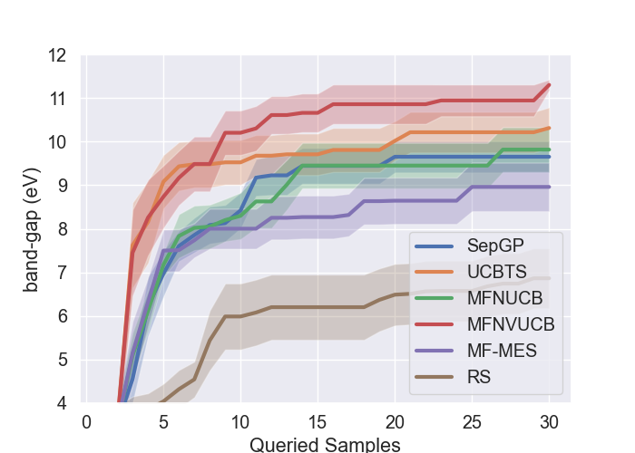

# iMFBO

This is the repository for the implementation of the paper **Multi-fidelity Bayesian Optimization with Multiple Information Sources of
Input-dependent Fidelity**, which was accepted as a conference paper in UAI 2024 [link to be uploaded](https://www.auai.org/uai2024/).

Please check the `experiment` folder for the runnable examplar code and corresponding data.

To utilize the code, one needs to specify the target function, the surrogate model used, the acquisition function utilized, and finally
the experiment class. In the `experiment/real_exp.py` file we have an example code for running our/benchmark methods and how to combine these configurations.

For the required packages, please see the `requirement.txt` for the prerequisite packages or simply use 
>pip install requirements.txt

